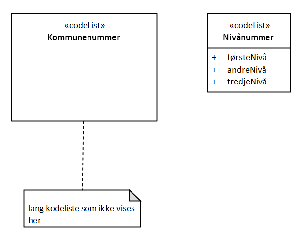
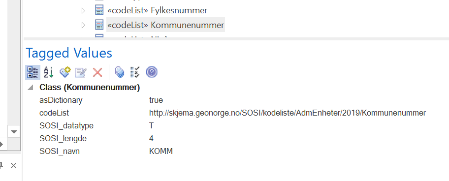

= Veileder i å modellere en kodeliste for ekstern forvaltning
Versjon 2024-08-27

Koder i kodelister skal ha navn etter samme mønster som alle andre UML-modellelementer, slik at lesere intuitivt forstår meningen med koden.
Kodelister med veldig mange koder er vanligvis ikke godt egnet til å vises i sin helhet i et UML-diagram.

Slike kodelister er best realisert som eksternt forvaltede kodelister, dette vil si at kodelisten forvaltes utenfor modellen og kan endres levende.
For å oppnå dette må kodelisten merkes som en eksternt forvaltet kodeliste, og den må brukes til å generere kodelistefiler på standardisert format.
Dette gjøres i UML-modellen ved å legge inn to tagged values med navn asDictionary og codeList på kodelisten. Verdiene skal være henholdsvis true og en http-URI til stedet der kodelisten finnes.

Skript kan benyttes til å generere eksterne filer på ulike standardformat.
I filen fra SOSI-modellregister finnes skriptet listGMLDICTfraKodeliste som lager ei fil på standardisert GML-Dictionary-format. Høyreklikk på kodelista og kjør skripetet.
I filen fra SOSI-modellregister finnes skriptet listSKOSfraKodeliste som lager ei fil med underkatalog på SKOS/RDF/xml-format. Høyreklikk på kodelista og kjør skripetet.

<<<