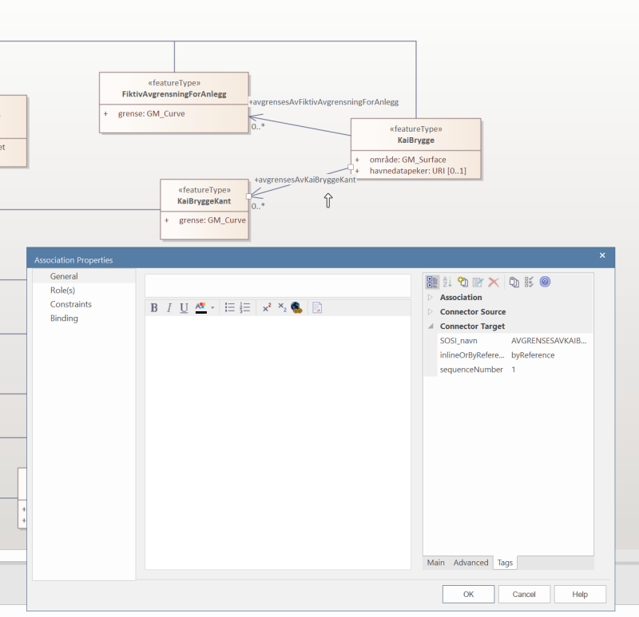

[.lead]Veileder i modellering av rekkefølgen på assosiasjonsroller i GML

//Versjon 2024-08-26

I GML (som i XML) er det krav på å følge samme rekkefølgen på elementene som de som er beskrevet i GML-Applikasjonsskjemafila (.XSD).
Rekkefølgen på egenskaper kontrolleres i Enterprise Architect, husk å ta vekk alfabetisk sortering under Start->Preferences->Objects.
Rekkefølgen på assosiasjonsroller kan kontrolleres ved å legge inn en tagged value med navn sequenceNumber på alle assosiasjonsrollene og gi disse unike serienummer.

.Eksempelfigur som viser tagged value sequenceNumber på en assosiasjonsrolle

<<<
