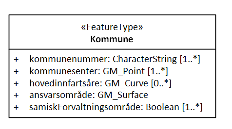

[discrete]
=== Veileder i modellering av egenskaper med geometri som datatyper (uferdig om topologi)

//Versjon 2024-08-27

[discrete]
==== Brukstilfeller

Brukstilfellene vil indikere hvilken type geometri som er nødvendig, enklest mulig geometritype bør alltid velges.
Tidligere ble norske klassenavn benyttet i modellene, Punkt, Kurve, Flate og Sverm. Dette er fortsatt støttet, og disse skal automatisk mappes til moderne og realiserbare typer.

.Eksempel på klasser med nasjonal og internasjonal geometritype:
image::./img/Eksempler-på-modellering-av-geometri-5.1.png[alt="X"]

[discrete]
==== Forholdet mellom nasjonale og internasjonale geometrityper

.Modell som viser forholdet mellom eldre nasjonale geometrityper og geometrityper i internasjonale standarder:

Det anbefales nå å modellere med de moderne internasjonale typene direkte. De vanligste av disse er GM_Point, GM_Curve, GM_Surface og GM_Solid.

.Her er listene over geometrityper i geometriprofilen SOSI-GML-delt3Dgeometri:

Listene over geometrityper i geometriprofilen SOSI-GML-heleid3Dgeometri er like, bortsett fra at klassene med GM_CompositeXxx mangler.

.Eksempel på modell med bruk av internasjonale geometrityper:

.Eksempelfigur med naboflater og enklaver:

Eksempel på datasett i GML-format med naboflater og enklaver:
http://skjema.geonorge.no/SOSITEST/produktspesifikasjon/Kommunefusjon5/2019/eksempel/KlasseMgeometriegenskaper3.gml

[discrete]
==== Modellering av egenskaper med heterogene geometrityper

Egenskaper med geometri som kan være enten punkt, kurve, flate eller legeme kan modelleres med typen GM_Object.
Dette vil generere GML_Applikasjonsskjema som tillater gml:Point, gml_Curve og gml:Surface (og gml:Solid).
OGC Simple Feature støtter dette, og Oracle, PostGIS  og QGIS  kan handtere slike heterogene geometriegenskaper.

TBD:-diagram--eksempelfigur--eksempelfigur-

[discrete]
==== Modellering og utveksling av objekters topologiske egenskaper

Dersom brukstilfellene krever utveksling av topologiegenskaper må UML-modellen angi dette eksplisitt.
Denne modelleringen er beskrevet i Regler for UML-modellering versjon 5 i kapittel 11.4.3.4 Topologi.
Realisering er beskrevet i standarden Realisering i GML-format versjon 5 i kapittel 8.5 Realisering av toplologi.
image::img/Topologiegenskaper.png
Nettverkstopologi kan alternativt modelleres som topologiske assosiasjoner i applikasjonsskjemaet. (Ledning, vegnett.)

TBD:-diagram

Modeller bør uansett beskrive topologiske restriksjoner som krav om full flatedekkning innen et område, eller krav om ingen overlapp mellom objekter.

TBD:-diagram--eksempelfigur-

Den vanligste praksis er at data modelleres og utveksles med heleide geometriegenskaper, og at topologien bygges opp i mottakersystemet i etterkant.
Oppbygging av topologistrukturer på mottakersiden er en omfattende prosess, spesielt med data fra flere kilder, med behov for identifisering av overlappende kurver og naboflater etc.

TBD:-diagram--eksempelfigur-

[discrete]
==== Delt geometri

Delt geometri er der en geometri kan beskrives i et objekt, og deles/refereres fra andre objekter. 
Bruk av dette kan ved spesielt nøye bruk unngå noen vanlige effekter som glipper og overlapp, spesielt ved avrunding av koordinater.
Dette gjøre at data med delt geometri vil kunne være mer topologiklare for mottakeren.
Men mottakerens topologioppbygging må ta høyde for at den delte geometrien også kan være bygget opp på en ikke-topologiklar måte.
Delt geometri må modelleres spesielt i UML, med geometriklasser av typen "Composite", for å kunne arve mekanismen med pekere til andre geometrier.

TBD:-diagram--eksempelfigur--eksempelfigur-

[discrete]
==== Normalisert geometri

Normalisert geometri betyr at hver posisjon beskrives kun en gang, og at det kun refereres til fra andre geometrier av høyere orden.
Mottakeren må da bygget opp fullstendig geometri for hvert objekt.
I SOSI-format og gml (og geojson?)  er det ikke vanlig praksis å referere til endepunkter på kurver, 
men geometrityper av typen "Composite" kan benyttes til å angi at man kan/skal bruke pekere til andre geometrier av lavere orden.

TBD:-diagram--eksempelfigur--eksempelfigur-

