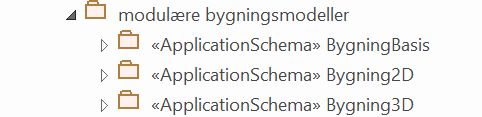
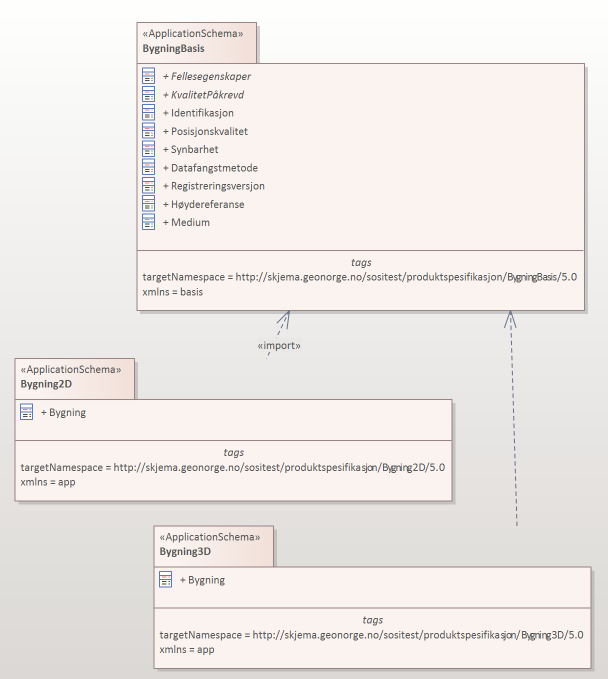
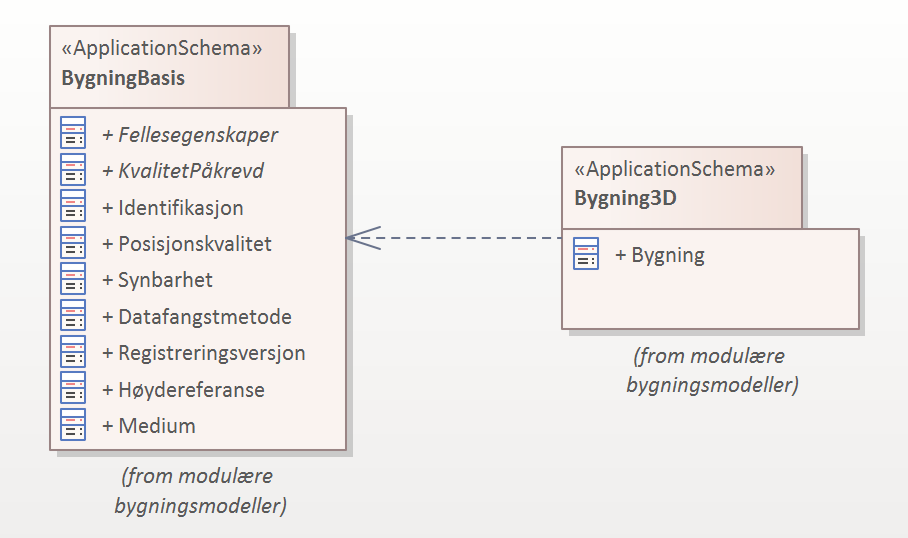
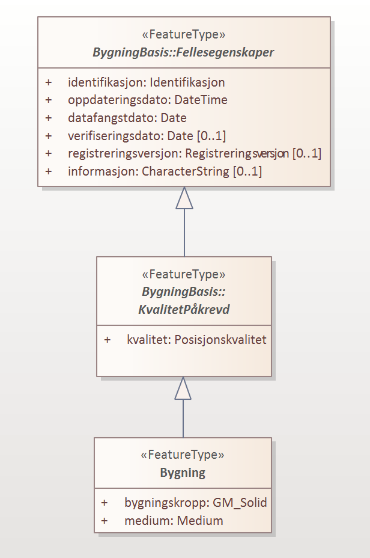
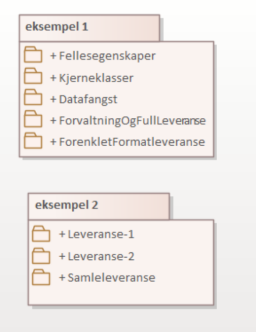
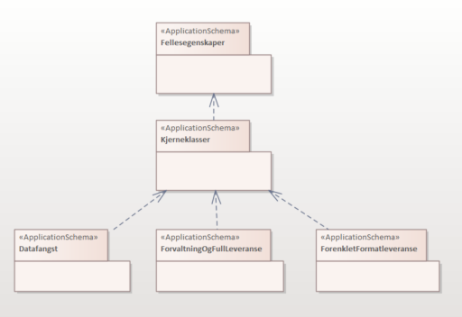
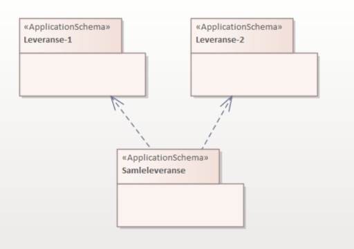

[discrete]
=== Veileder i å modellere en modulær SOSI produktspesifikasjon (Utkast)

//Versjon 2024-09-04

[discrete]
==== Tradisjonell modellering

Tradisjonell modellering av produkt er med kun et applikasjonsskjema med et felles applikasjonsskjema for alle brukstilfeller +
Denne løypa er godt innarbeidet i infrastrukturen og dekker godt brukstilfeller som har fokus på leveranser av forvaltningsdata. +
Dette dekker oftest også alle enklere brukstilfeller, om enn med å måtte få en del unødvendige data med på lasset. +

[discrete]
==== Modellering av produkt med fler enn et applikasjonsskjema

.Planlegg et applikasjonsskjema for hver gruppe av brukstilfeller eller for hver fase i en dataflyt eller dataformat
[%collapsible]
=====
* Gruppér brukstilfeller med fellestrekk og bestem hvordan modulstrukturen skal være.
* Lag en applikasjonsskjemapakke for hver modul.

* Gå inn i hver pakke og legg inn de klassene som hører hjemme der.
* Legg inn et unikt navnerom (targetNamespace) for hver applikasjonsskjemapakke.
* Legg inn et enkelt navneromsprefiks (xmlns) unikt for hver pakkegruppering. (eks. basis, app1, app2)

* Til støtte for valg av dataformat finnes utkast (2023-03-15) til en tabell over formater og karakteriseringskriterier. +
https://docs.google.com/spreadsheets/d/1n7tOR8Ny5DcOL9fn_4jZaXeLl33-mwDY2kwq2GAI7v4/edit#gid=98722557[Kriterier for valg av dataformat]

=====

.Dra inn pakker i pakkediagram og sett avhengigheter mellom disse
[%collapsible]
=====
* I pakker som skal være grunnlag for leveranser lages et pakkediagram som kalles Pakkeavhengighet.
* Dra inn denne pakka i pakkediagrammet.
* Dra inn de andre pakkene som elementene i denne pakka skal benytte elementer fra.
* Legg inn pakkeavhengighetspil fra denne pakka til de pakkene som man har avhengigheter til.

=====

.Dra inn datatyper og supertyper i hoveddiagrammene og sett referanser til disse
[%collapsible]
=====
* Åpne eksisterende hoveddiagrammer og dra aktuelle supertyper og datatyper fra andre pakker inn i diagrammet.
* Legg inn arvepiler til nye eksterne supertyper og koble opp egenskaper til nye eksterne datatyper.

(Liknende beskrivelser kan finnes i punkt 11 og 12 i den gamle veilederen).

=====

.Generer GML-Applikasjonsskjema (.xsd) for leveransepakkene
[%collapsible]
=====
* Lag en GML-Applikasjonsskjemafil (.xsd) som denne spesielle leveransen skal valideres mot.
* Høyreklikk på pakka i Browser og velg Specialize -> ShapeChange  -> Transform...

Eksempel på skjemafil med ekstern avhengighet finnes på http://skjema.geonorge.no/sositest/produktspesifikasjon/Bygning3D/5.0

=====

.Generer GML-eksempeldatafiler (.gml) for leveransepakkene
[%collapsible]
=====
* Lag en GML-fil med et objekt av hver objekttype og test at det som modellen beskriver kan leses i klienter.
* Høyreklikk på pakka i Browser og velg Specialize -> Scripts -> listGMLExample.

// Se enkel video:

// video::video/lageGMLEksempel.mp4[]

=====

.Hva kan modularitet brukes til?
[%collapsible]
=====
* Lager vi applikasjonsskjema med innhold som hensiktsmessige moduler kan vi sette dem sammen i ulike arkitekturer.

Eksempel 1 viser en felles kjerne som utvides for ulike formål. Disse implementerbare modulene kan beskrive ulike faser i dataflyten, og spesialtilpassinger til ulike leveranser.

Eksempel 2 viser ulike moduler for ulike formål, og en modul som beskriver en sammensatt leveranse.
=====

<<<
