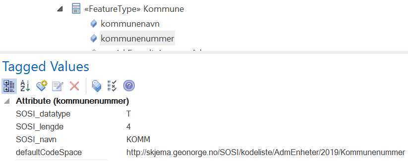

[.lead]
Veileder i valg av eksternt forvaltet kodeliste for Kommunenummer

//Versjon 2024-08-27

Ved modellering av en egenskap som inneholder eksternt forvaltede kommunenummer må det gjøres et valg mellom en spesifikk versjon av lista, eller den til enhver tid gjeldende liste. Den gjeldende lista vil oppdateres sentralt på et planlagt tidspunkt.
Velges spesifikk versjon vil datasettet alltid være gyldig, men kan bli foreldet i forhold til de fleste brukstilfeller.
Velges gjeldende versjon vil datasettet kunne bli ugyldig ved validering mot oppdatert liste, og dataeier må derfor alltid holde datasettet levende oppdatert og følge alle oppdateringer i kodelista.
Det er viktig å kjenne endringsmønsteret og planlegge hvordan endringer i kommuneinndelingen detekteres, og når og hvordan innholdet i datasettet skal oppdateres.
Det vil si om det kan kjøres skript i datasettet, eller om full omlasting må gjøres, og presist når dette må skje.

Spesifikk versjon angis ved å la versjonsinformasjonen (2019) ligge med i stien, som vist under:

tagged value defaultCodeSpace = http://skjema.geonorge.no/SOSI/kodeliste/AdmEnheter/2019/Kommunenummer

.egenskapens sti til kodelista

Dersom meningen er å holde et datasett levende oppdatert bør stien kun inneholde produktnavnet, som vist under:

tagged value defaultCodeSpace = http://skjema.geonorge.no/SOSI/kodeliste/AdmEnheter/Kommunenummer

<<<
