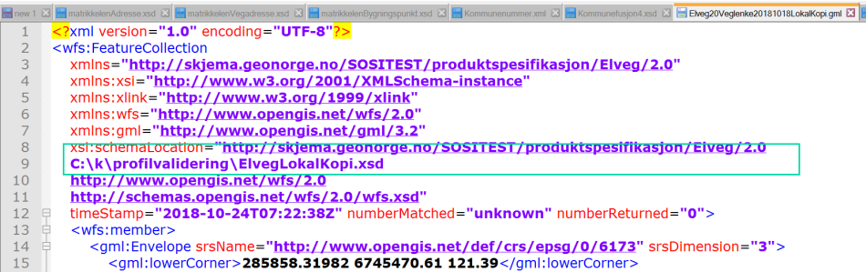

[discrete]
=== Veileder i validering av geometrien i en GML-datafil mot norsk SOSI-GML-profil

//Versjon 2024-09-06

Produktspesifikasjoner kan angi at de kun benytter et navnet subsett av geometrityper i den fulle GML 3.2.1 standarden. (I kapittel 11) 
Dette kan verifiseres ved å validere mot en SOSI-GML-profil som beskrevet i standarden: **SOSI del 1 - Realisering i GML-format - versjon 5.0.**

Der beskrives profilene:

* SOSI-GML-heleid2Dgeometri
* SOSI-GML-heleid3Dgeometri
* SOSI-GML-delt2Dgeometri
* SOSI-GML-delt3Dgeometri

Automatisk validering bør kunne kjøres fra alle vanlige norske valideringsprogrammer for GML-datafiler, men her beskrives en mer manuell metode for validering.

Velg en GML-datafil som skal verifiseres at er i henhold til en bestemt SOSI-GML-profil.

.Identifiser hvilken GML-applikasjonsskjemafil som beskriver produktets navnerom.

.Hent ned og lagre en lokal kopi av GML-applikasjonsskjemafila, og modifisér importen av GML til å koble navnerommet med prefiks gml: til en SOSI-GML-profil.

Til:

.sti til skjemafil som beskriver en SOSI-GML-profil

.Modifisér GML-datafila til å bruke den lokale GML-applikasjonsskjemafila ved å rette i xsi:schemaLocation. (Bør kunne bruke absolutt eller relativ sti.)

* Åpne GML-datafila i en profesjonell XML-editor (oxygen, xmlspy, eclipse, ...) og start validering.
* Merk at denne skjemavalideringen ikke også sjekker logikken med at 2D geometrier forholder seg til 2D koordinatreferansesystem, og 3D geometrier krever et 3D koordinatreferansesystem.
* Dette må gjøres ved å inspisere GML-datafilas verdier i xml-egenskapen srsName og manuelt sammenligne denne med verdiene i de to listene for 2D- og 3D-koordinatreferansesystemer.

Najonalt anbefalt subsett av koordinatreferansesystemkoder finnes i SOSI del 1 - Realisering i SOSI-format - versjon 5.0.

2D:

* EPSG/0/4258		EUREF 89 Geografisk (ETRS 89)
* EPSG/0/4326		WGS84 geografisk
* EPSG/0/32629	UTM 29 basert på WGS84 (etc.)
* EPSG/0/25829	UTM 29 basert på EUREF89 (etc.)
* EPSG/0/5105		NTM 5 basert på EUREF89 (etc.)
* EPSG/0/3035		EUREF89 LAEA Lambert asimut
* EPSG/0/3034		EUREF89 LCC Lambert konisk
* EPSG/0/27391	NGO 1948

3D:

* EPSG/0/6144		ETRS89 + NN54
* EPSG/0/5942		ETRS89 + NN2000
* EPSG/0/4937		WGS84 + ellipsoidehøyde 
* EPSG/0/6169		UTM 29 basert på EUREF89 + NN54 (etc.)
* EPSG/0/5973		UTM 29 basert på EUREF89 + NN2000 (etc.)
* EPSG/0/6145		NTM 5 basert på EUREF89 + NN54 (etc.)
* EPSG/0/5945		NTM 5 basert på EUREF89 + NN2000 (etc.)
* EPSG/0/4896		ITRF 2005
* EPSG/0/...			(Hva med ITRF 2014?)

NB:
Mange visningsverktøy for GML-datafiler handterer akserekkefølge og akseenhet korrekt basert på EPSG-koden.
Men de har ikke (2018) implementert at akseantall også er en entydig funksjon av EPSG-koden, så det anbefales i tillegg å legge inn srsDimension eksplisitt på 3D-data.

``<gml:Curve srsName="http://www.opengis.net/def/crs/epsg/0/6173" srsDimension="3">``

